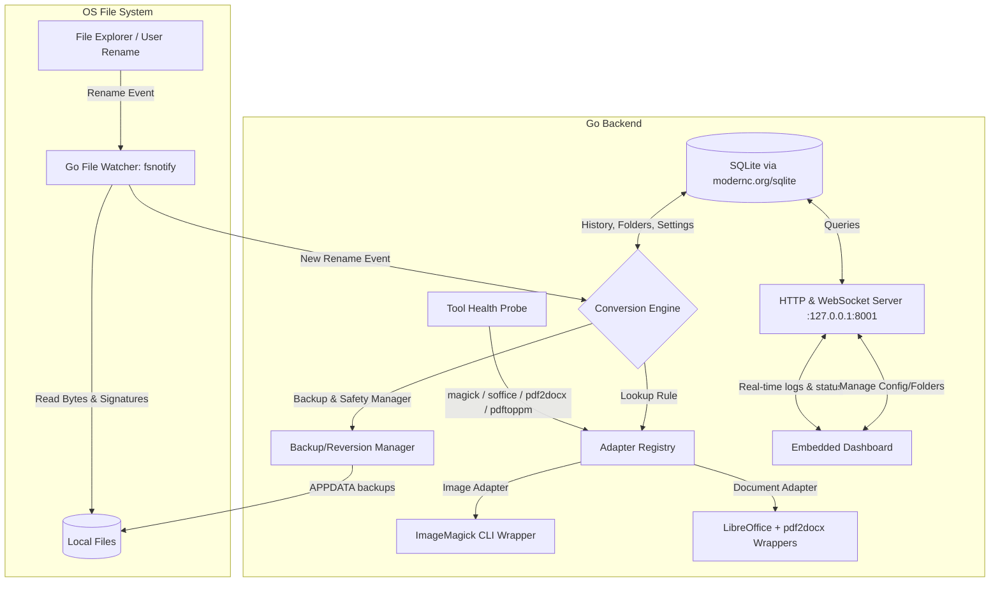

# Product Requirements Document (PRD)
## BoomConvert: Magic Extension-Based File Converter (Go Edition)

### 1. Executive Summary & Vision
**BoomConvert** is a lightweight, local-first utility designed to simplify file conversion to the absolute limit. Instead of opening a web browser, uploading sensitive files to cloud converters, or launching heavy software, users convert files by simply **renaming the file extension in their file explorer** (e.g., renaming `vacation.jpeg` to `vacation.png`).

BoomConvert runs as a lightweight background service written in **Go (Golang)**. Go's native speed, small memory footprint, and ability to compile into a single static binary make it ideal for an unobtrusive background utility. The service watches configured "Magic Folders", intercepts extension changes, validates the file's true format, performs local conversion by orchestrating best-in-class external tools (ImageMagick, LibreOffice, Poppler, pdf2docx), and overwrites/replaces the renamed file with the actual converted file. A premium web-based dashboard provides a control center for monitoring conversions, managing watched folders, viewing statistics, and inspecting tool health.

---

### 2. Core Features & User Flows

#### A. Magic Folders (Background File Watcher)
*   **Folder Monitoring**: Monitor user-defined folders recursively using the Go `fsnotify` library.
*   **Rename Interception**: Catch file rename events. On Windows, cross-directory renames surface as `REMOVE` + `CREATE` pairs; the watcher correlates these by inode/size/timing.
    *   *Trigger*: A file's extension changes (e.g., `document.pdf` → `document.docx`).
    *   *Verification*: Read the file's magic bytes (file signature) to determine the true source format. This prevents executing conversions if the user just renamed a file to fix an incorrect extension.
    *   *Conversion Execution*: If a valid conversion rule exists for `True Format` → `Target Extension` **and the required external tool is available**, trigger the conversion pipeline.
    *   *Case & compound extensions*: Extensions matched case-insensitively (`.JPG` ≡ `.jpg`). Only the final segment is treated as the extension (`archive.tar.gz` → `.gz`).

#### B. Conversion Pipeline
*   **Local Processing**: All conversions happen locally to guarantee privacy, speed, and offline capability.
*   **Backup & Safety First**:
    1.  Copy the source file to a central backup folder outside any watched tree (e.g. `%APPDATA%/BoomConvert/backups/` on Windows, `~/.boomconvert/backups/` on Unix). This avoids fsnotify feedback loops and centralises retention.
    2.  Perform the conversion to a temporary `*.tmp` file in the target directory.
    3.  Atomically rename the `*.tmp` file to the user-requested target filename. Partial writes are never visible.
    4.  **Backup Persistence**: Originals are retained indefinitely (subject to user-configurable retention). The dashboard provides a "Restore" button per entry.
    5.  If conversion fails, restore the original file contents and original extension, and notify the user via the dashboard.

#### C. BoomConvert Web Dashboard
A sleek, premium local web interface (served by Go's HTTP server bound to **`127.0.0.1:8001`** — never `0.0.0.0`) consisting of:
*   **Status Overview**: Watcher status (Active / Paused) with toggle.
*   **Tool Health Panel**: Live status of each external tool (ImageMagick, LibreOffice, Python+pdf2docx, Poppler). Shows version, path, and one-click install commands (`winget` / `choco` / `apt` / `brew`) for missing tools.
*   **History & Feed**: Timeline of recent conversions showing size difference, duration, and status (`Converting`, `Completed`, `Failed`, `Reverted`).
*   **Magic Folder Manager**: Add, remove, or temporarily disable watched directories.
*   **Conversion Matrix View**: Dynamically rendered — only displays rules whose required tools are detected.
*   **Backup Browser**: Browse, restore, or permanently delete backed-up originals.
*   **Analytics Panel**: Space saved counter, total conversions completed, format distribution charts.

---

### 3. Technical Architecture

#### A. Tech Stack
*   **Backend Service**: Go (Golang)
    *   *File Watcher*: `github.com/fsnotify/fsnotify`
    *   *Web Server*: Standard library `net/http` bound to `127.0.0.1:8001`
    *   *WebSockets*: `github.com/gorilla/websocket`
    *   *Magic Type Detection*: `github.com/h2non/filetype`
    *   *Database*: `modernc.org/sqlite` (pure-Go SQLite — no CGO, no external SQLite install, single static binary preserved). DB file at `%APPDATA%/BoomConvert/boomconvert.db`. WAL mode enabled.
*   **Frontend Dashboard**: HTML/JS/CSS served as static assets embedded directly in the Go binary using `go:embed`.
*   **External Conversion Tools** (auto-detected at startup; missing tools gracefully disable their rules):
    *   *Images*: **ImageMagick** (`magick`) — any-to-any across JPEG, PNG, GIF, WebP, BMP, TIFF, ICO.
    *   *Documents*: **LibreOffice** (`soffice --headless`) for DOCX↔PDF and PPTX↔PDF; **Python + `pdf2docx`** for high-fidelity PDF→DOCX; **Poppler** (`pdftoppm`) used as a fallback page rasteriser.

---

### 4. Supported Conversion Matrix (v1 Scope)

#### Images (any-to-any via ImageMagick)
Source ∈ {JPEG, PNG, GIF, WebP, BMP, TIFF, ICO} → Target ∈ same set.

| Pair Class | Tool | Notes |
| :--- | :--- | :--- |
| Any → JPEG | ImageMagick | Alpha flattened to white background. Quality configurable. |
| Any → PNG | ImageMagick | Lossless. Preserves alpha. |
| Any → WebP | ImageMagick | Lossy by default; lossless mode available. |
| Any → GIF / BMP / TIFF / ICO | ImageMagick | Standard encoding. |

#### Documents

| Source | Target | Tool | Fidelity |
| :--- | :--- | :--- | :--- |
| **DOCX** | `.pdf` | LibreOffice headless | Excellent |
| **PPTX** | `.pdf` | LibreOffice headless | Excellent |
| **PDF** | `.docx` | `pdf2docx` (Python) | Good — preserves most layout |
| **PDF** | `.pptx` | *Out of scope for v1* | No reliable open-source path |
| **DOCX** | `.pptx` | *Out of scope for v1* | No reliable open-source path |
| **PPTX** | `.docx` | *Out of scope for v1* | No reliable open-source path |

Out-of-scope pairs are explicitly surfaced in the dashboard as "Not supported in v1" rather than producing low-fidelity output.

---

### 5. Error Handling & Data Safety Rules
The system must enforce these strict guardrails to prevent infinite loops and data corruption:
1.  **Strict Signature Check**: Go's `filetype` library inspects file signatures. If the extension matches the signature, it is treated as a manual rename correction and **no conversion is triggered**.
2.  **Tool Availability Gate**: A conversion is only attempted if its required external tool is detected by Tool Health. Otherwise the rename is reverted and the dashboard surfaces a "tool missing" event with install instructions.
3.  **Conversion Timeout**: Each adapter invocation runs under a `context.WithTimeout` (configurable per format family; default 60s for images, 300s for documents).
4.  **Atomic Writes**: Convert into `<target>.tmp` and rename to `<target>` only on success. Failed conversions leave the original untouched.
5.  **Centralised Backup Persistence**: Originals are copied to `%APPDATA%/BoomConvert/backups/` before conversion and kept indefinitely. This location is outside any watched tree by design, so fsnotify cannot loop on backup writes.
6.  **Failure Reversion**: On failure, the original filename and contents are restored from the backup; the user is notified.
7.  **Infinite Loop Prevention**: A mutex-protected in-memory map of files BoomConvert is actively writing causes fsnotify events for those paths to be skipped.
8.  **Network Binding**: HTTP server binds only to `127.0.0.1`. Never exposed on `0.0.0.0`.
9.  **Compound & Case Handling**: Extensions matched case-insensitively; only the last segment after `.` is the extension.
